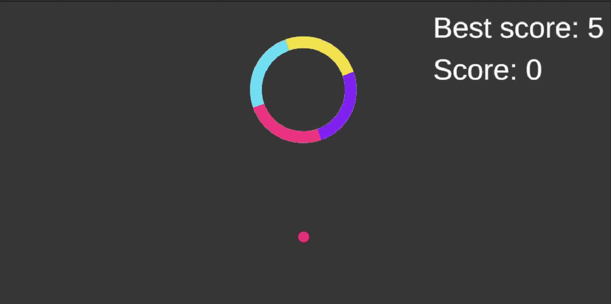
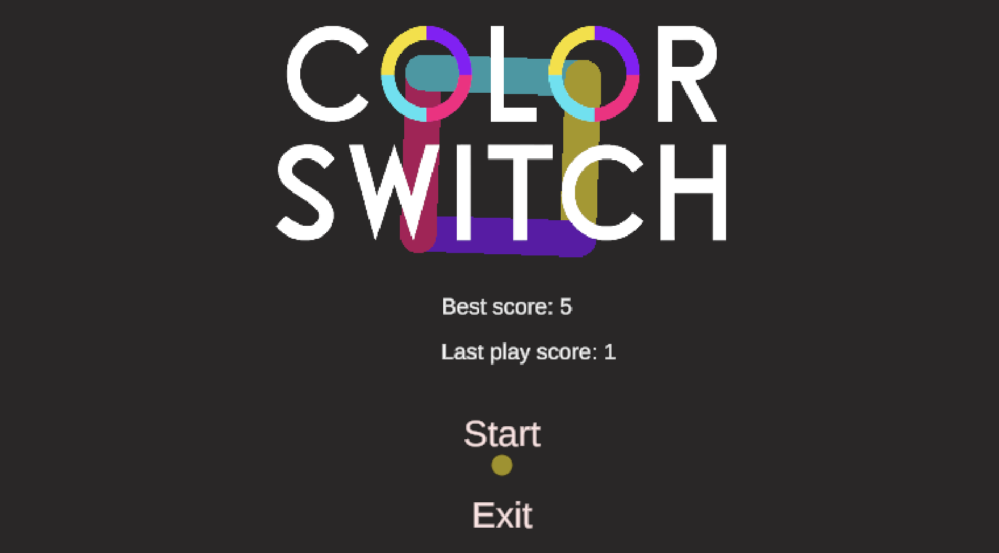

# 🎮 Color Switch (Unity)

**Color Switch** is a small game developed with **Unity**, designed with simple mechanics that test the player’s reflexes and focus.  

## Project Description
- Control the player to jump through rotating, multi-colored obstacles.  
- Current score and highest score are displayed on screen.  
- Simple sound effects: jump, button click, star collection, and game over.  
- One background music (BGM) track plays throughout the game.  

## Technologies
- Unity (2021+)  
- TextMeshPro for score and high score display.  
- AudioSource + AudioClip system for sound management.  

## 📸 Screenshot

---

This project was developed for **learning and personal purposes**.
